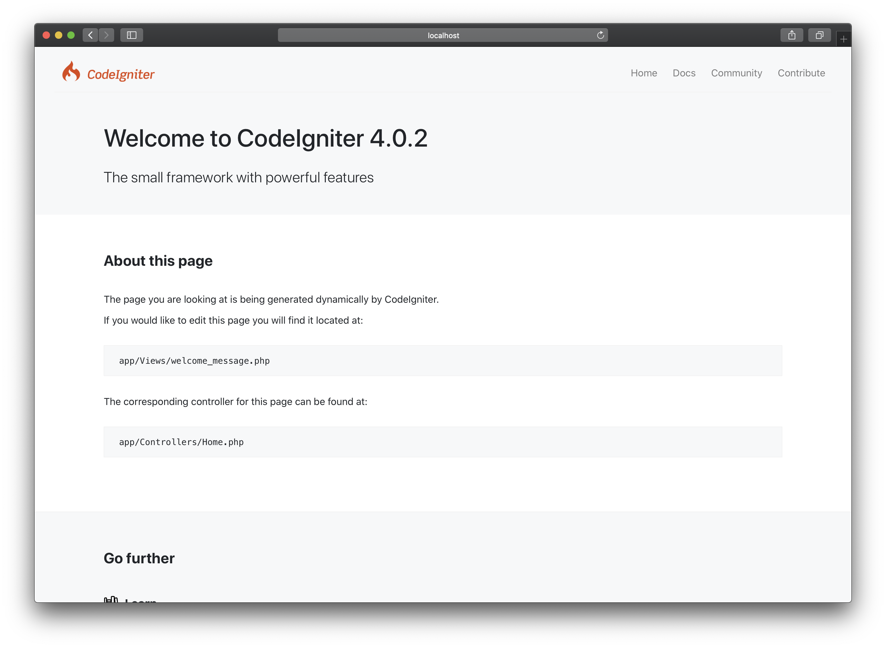
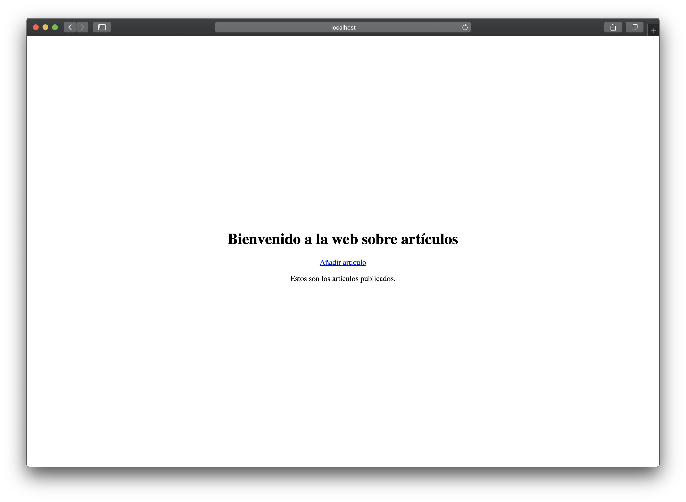
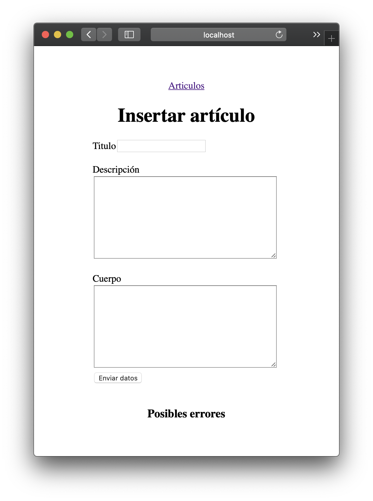
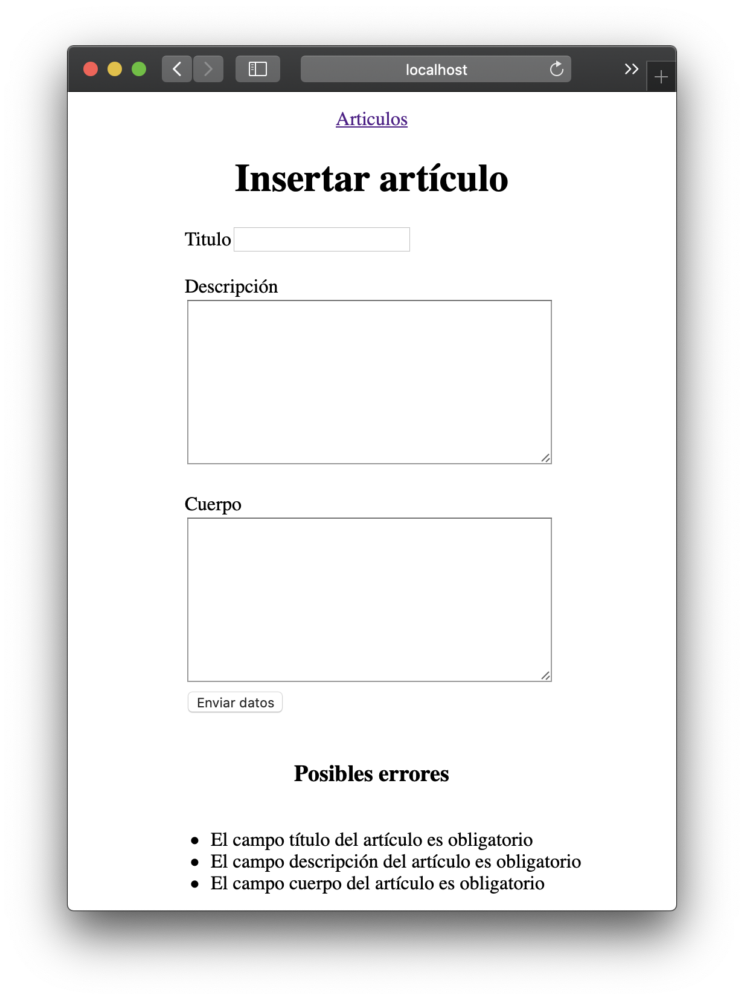
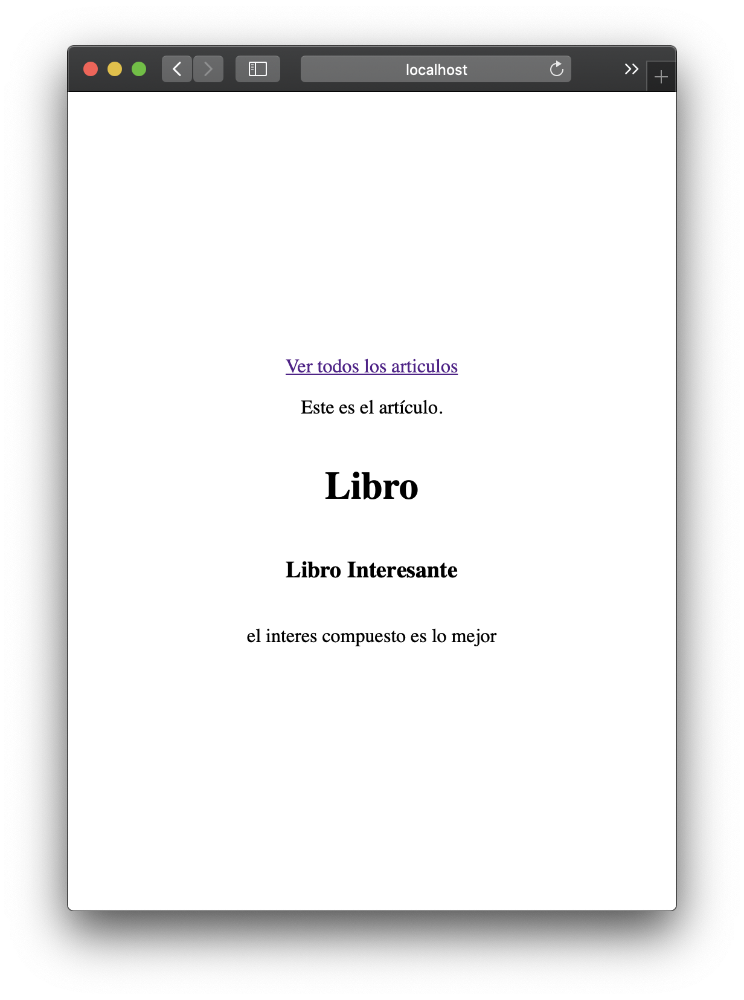

<style>
.is-flex-center {
  display:flex;
  justify-content:center;
  align-items:center;
}
.is-column {
  flex-direction:column;
}
</style>
<div class="is-flex-center is-column">
  <h1>Codeigniter</h1>
  <h6>Carlos Rodrigo Sanabria Flores</h6>
</div>
<div class="page"></div>

## Instalación

### Iniciar un nuevo proyecto

```sh
composer create-project codeigniter4/appstarter project-name
```

Ahora podemos ir al nuestro navegador de preferencia para visualizar el home por defecto https://localhost



> Guia para [codeigniter 4](https://codeigniter4.github.io/userguide/)

<div class="page"></div>

## Cofiguracion Inicial

### Cargas Automaticas

Codeigniter 3 nos permitia cargar librarias y helpers automaticamente, en la version 4 debemos crear un `BaseController.php`

```php
<?php
// app/Controllers/BaseController.php
namespace App\Controllers;

use CodeIgniter\Controller;

class BaseController extends Controller
{
    /**
     * An array of helpers to be loaded automatically upon
     * class instantiation. These helpers will be available
     * to all other controllers that extend BaseController.
     *
     * @var array
     */
    protected $helpers = ['form', 'url'];

    /**
     * @var \CodeIgniter\Session\Session
     */
    protected $session;

    /**
     * Constructor.
     */
    public function initController(
      \CodeIgniter\HTTP\RequestInterface $request,
      \CodeIgniter\HTTP\ResponseInterface $response,
      \Psr\Log\LoggerInterface $logger)
    {
        parent::initController($request, $response, $logger);
        //--------------------------------------------------------------------
        // Preload any models, libraries, etc, here.
        //--------------------------------------------------------------------
        $this->session = \Config\Services::session();
    }
}
```

* **Librerias**
  * [Database](https://codeigniter4.github.io/userguide/database/configuration.html#id1) se carga automaticamente la configuracions se puede modificar en el fichero `.env`
  * [Session](https://codeigniter4.github.io/userguide/libraries/sessions.html) se debe cargar en el `BaseController::initController`
  * [Validation](https://codeigniter4.github.io/userguide/libraries/validation.html) la libreria es cargada como el servicio `validator` 
* **Helpers**
  * [url](https://codeigniter4.github.io/userguide/helpers/url_helper.html)
  * [form](https://codeigniter4.github.io/userguide/helpers/form_helper.html)

<div class="page"></div>

### Cofigurar la base de datos

```sh
cp env .env
```

Editar las siguientes variables de entorno

```
database.default.hostname=localhost
database.default.database=ci4
database.default.username=root
database.default.password=root
database.default.DBDriver=MySQLi
```
<div class="page"></div>

## Articulos

### Controlador Articulos

```php
<?php
// app/Controllers/Articulos.php
namespace App\Controllers;

use App\Models\ArticuloModel;

class Articulos extends BaseController
{
    public function index($id = null)
    {
        $articuloModel = new ArticuloModel();
        if (is_null($id)) {
            return view('articulos', ['data' => $articuloModel->findAll()]);
        }

        return view('articulo', $articuloModel->find($id));
    }
}
```

### Vista Articulos

```php
<!DOCTYPE html>
<html lang="en">

<head>
  <meta charset="UTF-8">
  <meta name="viewport" content="width=device-width, initial-scale=1.0">
  <title>Articulos</title>
</head>

<body>
  <div style="height:100vh;display:flex;justify-content:center;align-items:center;flex-direction:column;">
    <h1>Bienvenido a la web sobre artículos</h1>
    <a href="<?php echo base_url('formulario'); ?>" title="Añadir articulo">Añadir articulo</a>
    <p>Estos son los artículos publicados.</p>
    <?php foreach ($data as $articulo) { ?>
    <a href="<?php echo base_url(['articulos', $articulo['id']]); ?>" title="Ver articulo">
    <h2><?php echo $articulo['titulo']; ?></h2>
    </a>
    <p><?php echo $articulo['descripcion']; ?></p>
    <br/>
    <?php } ?>

  </div>
</body>

</html>
```

<div class="page"></div>

### Resultado



<div class="page"></div>

### Formulario para crear articulos

#### Controlador

```php
<?php
// app/Controllers/Formulario.php
namespace App\Controllers;

use App\Models\ArticuloModel;

class Formulario extends BaseController
{
    public function index()
    {
        $messages = [
            'required' => 'El campo {field} es obligatorio',
            'max_length' => 'El campo {field} tiene como máximo {param} caracteres.',
        ];
        $rules = [
            'titulo' => [
              'label' => 'título del artículo',
              'rules' => 'required|max_length[100]',
              'errors' => $messages
            ],
            'descripcion' => [
              'label' => 'descripción del artículo',
              'rules' => 'required|max_length[200]',
              'errors' => $messages
            ],
            'cuerpo' => [
              'label' => 'cuerpo del artículo',
              'rules' => 'required',
              'errors' => ['required' => $messages['required']]
            ],
        ];

        if (!$this->validate($rules)) {
            return view('formulario', [
                'errors' => $this->request->getPostGet('submit') ? $this->validator->listErrors() : '',
            ]);
        }

        $articuloModel = new ArticuloModel();
        $data = $this->request->getPost();
        $articuloModel->insert($data);

        return view('articulo', $data);
    }
}
```
<div class="page"></div>

#### Vista

```php
<!DOCTYPE html>
<html lang="en">

<head>
  <meta charset="UTF-8">
  <meta name="viewport" content="width=device-width, initial-scale=1.0">
  <title>Articulos</title>
</head>

<body>
  <div style="height:100vh;display:flex;justify-content:center;align-items:center;flex-direction:column;">
  <a href="<?php echo base_url('articulos'); ?>" title="Articulos">Articulos</a>
<h1> Insertar artículo </h1>
<?php
echo form_open(base_url('formulario'), ['name' => 'mi_form', 'id' => 'form']);
echo form_label('Titulo', 'Titulo', ['class' => 'label']);
echo form_input('titulo', '', 'class="input"'); ?> <br />
<br />
<?php echo form_label('Descripción', 'Descripción', ['class' => 'label']); ?>
<br/>
<?php echo form_textarea('descripcion', '', 'class="textarea" row="25px"'); ?>
<br />
<br />
<?php echo form_label('Cuerpo', 'Cuerpo', ['class' => 'label']); ?>
<br /> <?php echo form_textarea('cuerpo', '', 'class="textarea" row="50px"'); ?>
<br />
<?php echo form_submit('submit', 'Enviar datos', 'class="submit"');
 echo form_close(); ?>
<br />
<h3>Posibles errores</h3> 
<?php echo $errors; ?>
</div>
</body>

</html>
```

<div class="page"></div>

**Formulario Inicial**



<div class="page"></div>

**Formulario con errores**



<div class="page"></div>

### Un Articulo
#### Vista

```php
<!DOCTYPE html>
<html lang="en">

<head>
  <meta charset="UTF-8">
  <meta name="viewport" content="width=device-width, initial-scale=1.0">
  <title>Articulos</title>
</head>

<body>
  <div style="height:100vh;display:flex;justify-content:center;align-items:center;flex-direction:column;">
    <a href="<?php echo base_url('articulos'); ?>" title="Ver todos los articulos">
    Ver todos los articulos</a>
    <p>Este es el artículo.</p>
    <h1><?php echo $titulo; ?></h1>
    <h3><?php echo $descripcion; ?></h3>
    <p><?php echo $cuerpo; ?></p>
  </div>
</body>

</html>
```



<div class="page"></div>

## Interactuar con la Base de datos

En esta version podemos utilizar migrations para crear nuestra base de datos a partir de codigo php.

### Creando la tabla articulos

Codeigniter nos proporciona una aplicacion cli con la que podemos manegar nuestra migrations

Para crear un template de migracion.

```sh
php spark migrate:create Articulos
```

```php
<?php

namespace App\Database\Migrations;

use CodeIgniter\Database\Migration;

class Articulos extends Migration
{
    public function up()
    {
        $this->forge->addField([
            'id' => [
                'type' => 'INT',
                'constraint' => 5,
                'unsigned' => true,
                'auto_increment' => true,
            ],
            'titulo' => [
                'type' => 'VARCHAR',
                'constraint' => '100',
            ],
            'descripcion' => [
                'type' => 'VARCHAR',
                'constraint' => '100',
            ],
            'cuerpo' => [
                'type' => 'TEXT',
            ],
        ]);
        $this->forge->addKey('id', true);
        $this->forge->createTable('articulos');
    }

    //--------------------------------------------------------------------

    public function down()
    {
        $this->forge->dropTable('articulos');
    }
}
```

Para aplicar las migraciones

```sh
php spark migrate
```

<div class="page"></div>

## Creando el Modelo Articulos

```php
<?php

namespace App\Models;

use CodeIgniter\Model;

class ArticuloModel extends Model
{
    protected $table = 'articulos';
    protected $primaryKey = 'id';
    protected $returnType = 'array';
    protected $useSoftDeletes = false;
    protected $DBGroup = 'default';

    protected $allowedFields = ['titulo', 'descripcion', 'cuerpo'];
}
```

Los modelos en codeigniter 4 nos proporcionan una serie de metodos por defecto:

* `find($id)` : Devuelve un solo resultado que coincida con el id
* `findAll()`: Devulve un array con toda las filas de un modelo
* `insert($data)`: Añade una nueva fila a partir de un array asociativo siempre que conentga las claves de `$allowedFields`